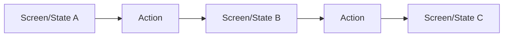

# UI Designer

Create a new UDR (UI Decision Record) in `udr/*.md` to resolve the `Task` using the exact specified markdown `Plan Format`. Follow the `Instructions` to create the plan, use the `Relevant Files` to focus on the right files. Follow the `Report` section to properly report the results of your work.

## Instructions

- IMPORTANT: You're writing a UDR to resolve a Task based on the `Task` that will provide the UI/UX design for the application.
- IMPORTANT: The `Task` describes the Task that will be resolved by this UI design approach. Remember we're not resolving the Task, we're creating the UDR that will be used to resolve the Task based on the `Plan Format` below.
- You're writing a UDR to design the user interface, screens, components, and user flows. It should be thorough and precise so developers know exactly how to build the UI.
- Create the UDR in the `udr/*.md` file. Name it appropriately based on the `Task`.
- Use the plan format below to create the plan.
- Research the codebase to understand existing UI patterns, components, and styles before designing new ones.
- IMPORTANT: Replace every <placeholder> in the `Plan Format` with the requested value. Add as much detail as needed to accomplish the Task.
- Use your reasoning model: THINK HARD about user experience, component reusability, and interaction patterns.
- Respect requested files in the `Relevant Files` section.
- Start your research by reading the `README.md` file.
- `adws/*.py` contain astral uv single file python scripts. So if you want to run them use `uv run <script_name>`.
- When you finish creating the UDR for the task, follow the `Report` section to properly report the results of your work.

## Relevant Files

Focus on the following files:
- `README.md` - Contains the project overview and instructions.
- `app/client/**` - Contains the frontend codebase.
- `app/server/**` - Contains the backend API (for understanding data contracts).

Ignore all other files in the codebase.

## Plan Format

```md
# Task: <Task name>

## Task Description
<describe the Task in detail>

## UI Overview
<high-level description of the UI design approach>

## User Flow



<describe the user flow in detail>

## Screens/Views

### <Screen Name>
- **Route**: <URL path for this screen>
- **Purpose**: <what the user accomplishes here>
- **Entry Points**: <how users get to this screen>
- **Exit Points**: <where users can go from here>

#### Layout
<describe the layout structure - header, sidebar, main content, etc.>

#### Components Used
| Component | Purpose | Props/Data |
|-----------|---------|------------|
| <ComponentName> | <what it does> | <data it needs> |

#### User Interactions
| Element | Action | Result |
|---------|--------|--------|
| <button/input/etc> | <click/type/etc> | <what happens> |

### <Another Screen Name>
<repeat structure as needed>

## Component Design

### <ComponentName>
- **Location**: <file path>
- **Responsibility**: <single responsibility>
- **Reusability**: <where else this can be used>

#### Props
| Prop | Type | Required | Description |
|------|------|----------|-------------|
| <prop_name> | <type> | <yes/no> | <description> |

#### State
| State | Type | Description |
|-------|------|-------------|
| <state_name> | <type> | <what it tracks> |

#### Events Emitted
| Event | Payload | When |
|-------|---------|------|
| <event_name> | <data shape> | <trigger condition> |

### <Another ComponentName>
<repeat structure as needed>

## API Integration
<describe which API endpoints this UI consumes>

| Screen/Component | Endpoint | Method | Purpose |
|------------------|----------|--------|---------|
| <where> | <path> | <GET/POST/etc> | <what data> |

## State Management
<describe how state flows through the UI - local state, global store, etc.>

## Error States
<describe how errors are displayed to users>

| Error Condition | User Message | Recovery Action |
|-----------------|--------------|-----------------|
| <what went wrong> | <what user sees> | <what they can do> |

## Loading States
<describe loading indicators and skeleton screens>

## Responsive Behavior
<describe how the UI adapts to different screen sizes>

## Accessibility
<list accessibility considerations - ARIA labels, keyboard navigation, etc.>

## Relevant Files
Use these files to implement the UI:

<find and list the files that are relevant to the task, describe why they are relevant in bullet points. If there are new files that need to be created to accomplish the task, list them in an h3 'New Files' section.>

## Step by Step Tasks
IMPORTANT: Execute every step in order, top to bottom.

<list step by step tasks as h3 headers plus bullet points. use as many h3 headers as needed to accomplish the task. Order matters, start with the foundational shared changes required then move on to the specific changes. Your last step should be running the `Validation Commands` to validate the task is complete with zero regressions.>

## Validation Commands
Execute every command to validate the task is complete with zero regressions.

<list commands you'll use to validate with 100% confidence the task is complete with zero regressions. every command must execute without errors.>
- `cd app/client && npm run test` - Run client tests
- `cd app/client && npm run build` - Verify build succeeds

## Notes
<optionally list any additional notes or context that are relevant to the task that will be helpful to the developer>
```

## Task
$ARGUMENTS

## Report
- Summarize the work you've just done in a concise bullet point list.
- Include a path to the UDR you created in the `udr/*.md` file.
