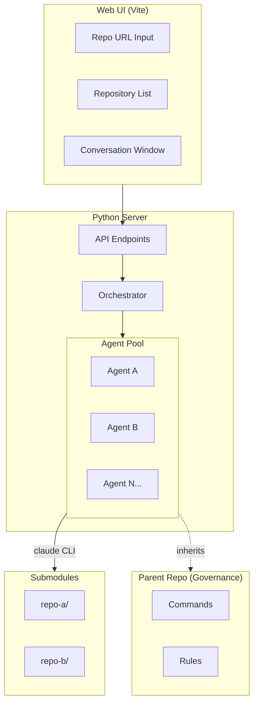
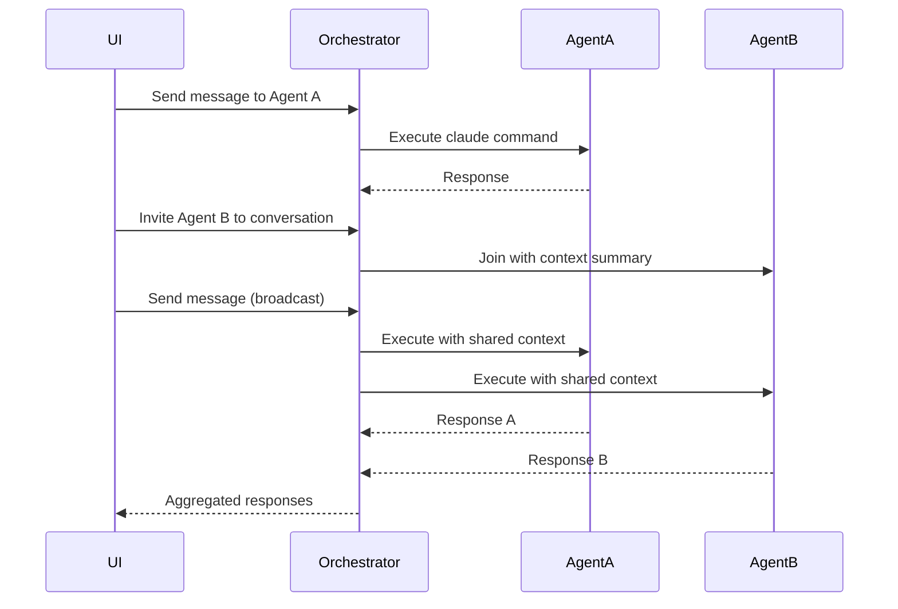
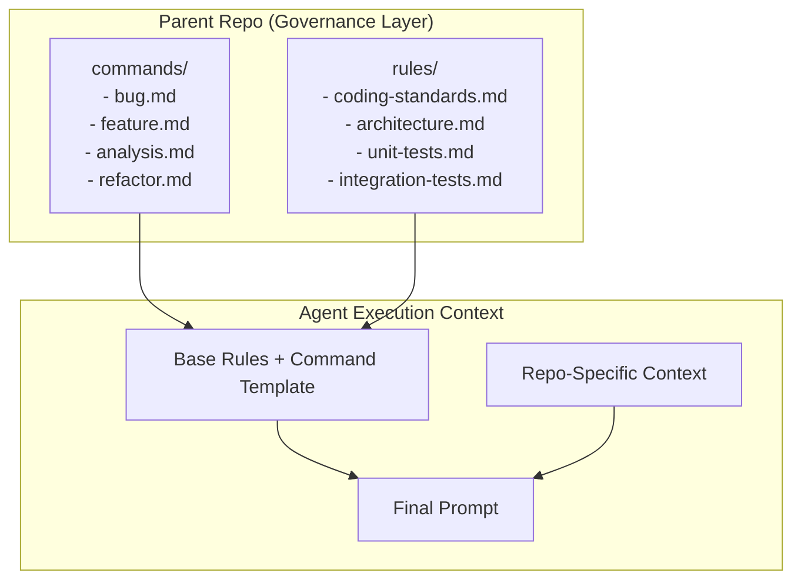
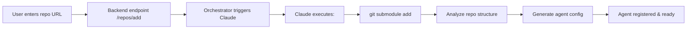

# ADW Workflows Multi-Repo

A web UI for orchestrating multiple repository agents with shared governance and Claude CLI integration.

## Objective

This project provides a centralized platform to manage multiple repositories through AI-powered agents. Each repository added as a submodule gets its own agent that can execute Claude commands, while inheriting base rules, commands, and best practices from the parent repository.

Key capabilities:
- Add repositories via URL (automatically creates submodules)
- Each repo gets an AI agent with contextual awareness
- Agents can join conversations and collaborate
- Centralized governance for coding standards, testing, and architecture

## Architecture Overview



## Agent Communication Protocol

Agents communicate through a central orchestrator - they never talk directly to each other.



## Governance & Inheritance Model

The parent repository acts as the governance layer, defining rules and commands that all agents inherit.



When an agent executes a command:
1. **Base rules** from parent (coding standards, test requirements)
2. **Command template** (bug, feature, analysis workflow)
3. **Repo-specific context** (what this repo does, its structure)

## Project Structure

```
adw-workflows-multi-repo/
├── commands/                  # Reusable Claude command templates
│   ├── bug.md                 # Bug fix workflow
│   ├── feature.md             # Feature implementation workflow
│   ├── analysis.md            # Code analysis workflow
│   └── refactor.md            # Refactoring workflow
├── rules/                     # Standards all repos must follow
│   ├── coding-standards.md    # Code style and conventions
│   ├── architecture.md        # Architectural decisions
│   ├── unit-tests.md          # Unit testing requirements
│   └── integration-tests.md   # Integration testing requirements
├── repos/                     # Git submodules (child repos)
├── agents/                    # Generated agent configurations
├── server/                    # Python backend
│   ├── orchestrator.py        # Central orchestrator
│   ├── agent.py               # Agent class
│   └── api.py                 # REST endpoints
└── ui/                        # Vite frontend
```

## Orchestrator Design

```python
class Agent:
    repo_path: str
    name: str
    conversation_history: list[dict]

    def execute(self, prompt: str, shared_context: dict = None) -> str:
        """One-shot claude call with history"""

class Conversation:
    id: str
    participants: list[Agent]
    messages: list[dict]  # {agent_id, role, content, timestamp}

    def add_agent(self, agent: Agent) -> None:
        """Agent joins with context summary"""

class Orchestrator:
    agents: dict[str, Agent]        # repo_url -> Agent
    conversations: dict[str, Conversation]

    def register_repo(self, repo_url: str) -> Agent:
        """Add repo as submodule, create agent via claude"""

    def create_conversation(self, agent_ids: list[str]) -> Conversation

    def send_message(self, conversation_id: str, message: str,
                     target_agents: list[str] = None) -> dict:
        """Route message to agent(s), return responses"""

    def invite_agent(self, conversation_id: str, agent_id: str) -> None:
        """Add agent to existing conversation with context"""
```

## Repository Registration Flow

When a user adds a repository URL:



The setup Claude command:
1. Adds the repository as a git submodule
2. Analyzes the repo structure (language, framework, entry points)
3. Creates an agent configuration with contextual awareness

**Generated agent config example:**
```json
{
  "name": "auth-service",
  "repo_path": "./repos/auth-service",
  "description": "Handles user authentication with JWT",
  "language": "python",
  "framework": "fastapi",
  "entry_points": ["src/main.py"],
  "system_prompt": "You are an agent for the auth-service repo..."
}
```

## Functional Requirements

- Input box to enter repository URL
- Add button (+) aligned with input to add repositories
- List of added repositories
- Panel showing changes/status of repositories
- Conversation window per repository with message history
- Option to invite agents from other repositories into a conversation

## Technical Requirements

- **Frontend**: Vite (React/Vue)
- **Backend**: Python (FastAPI recommended)
- **Agent Execution**: Claude CLI (one-shot with persisted history)
- **Storage**: In-memory (initial implementation)
- **Communication**: REST API between UI and server

## API Endpoints

| Endpoint | Method | Description |
|----------|--------|-------------|
| `/repos` | GET | List all registered repositories |
| `/repos` | POST | Add new repository (triggers submodule + agent setup) |
| `/repos/{id}` | DELETE | Remove repository and agent |
| `/conversations` | POST | Create new conversation |
| `/conversations/{id}/messages` | POST | Send message to conversation |
| `/conversations/{id}/agents` | POST | Invite agent to conversation |
